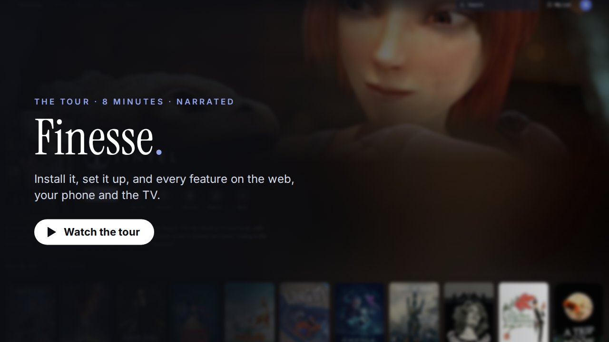
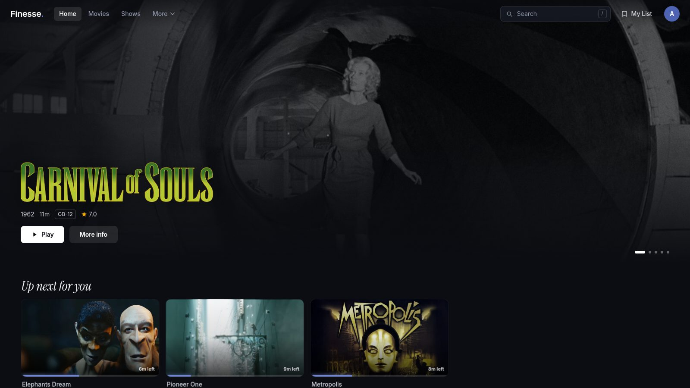
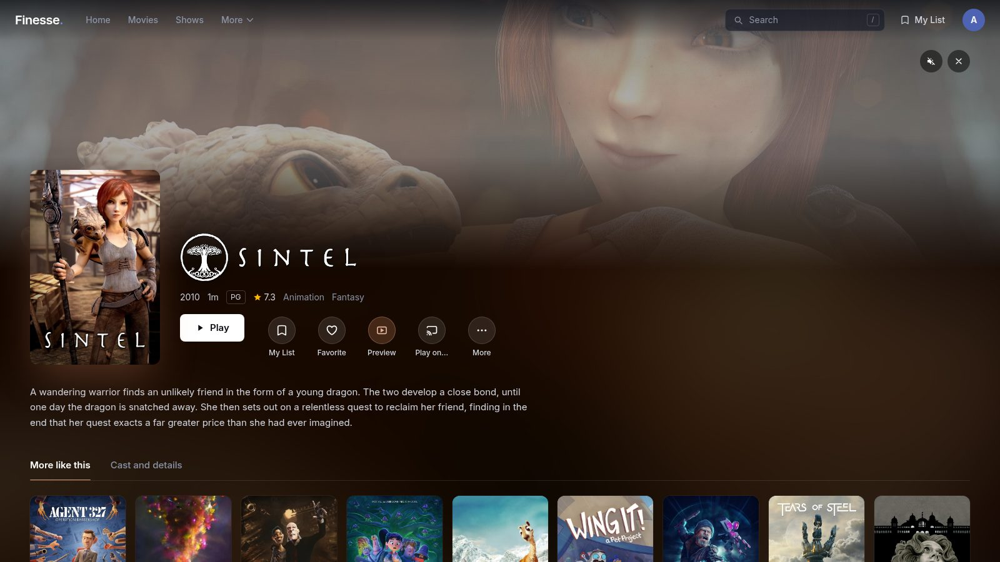
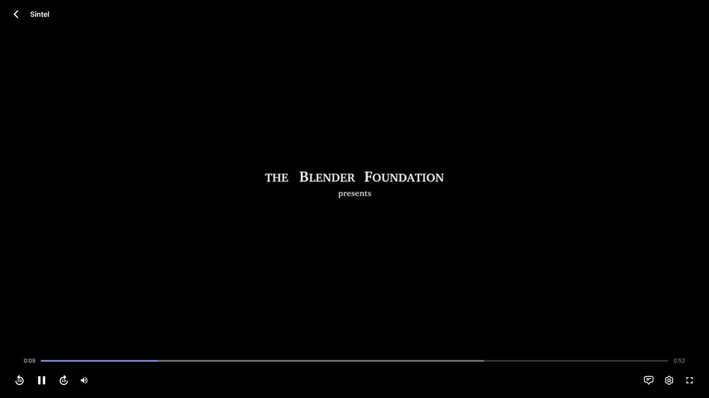
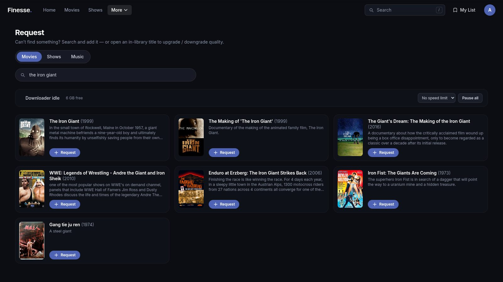
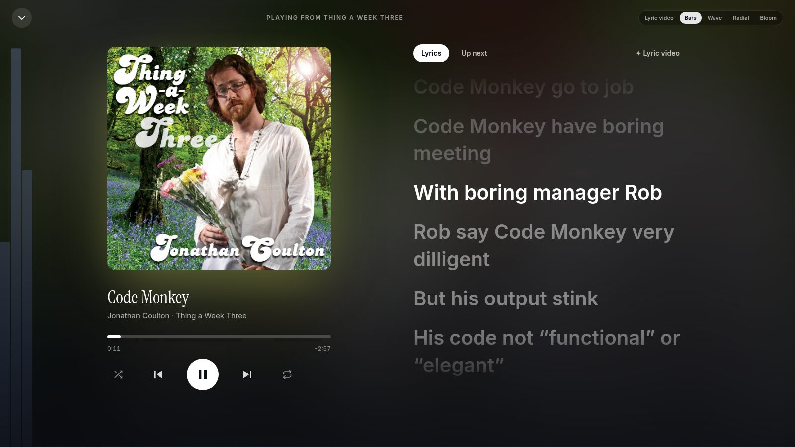
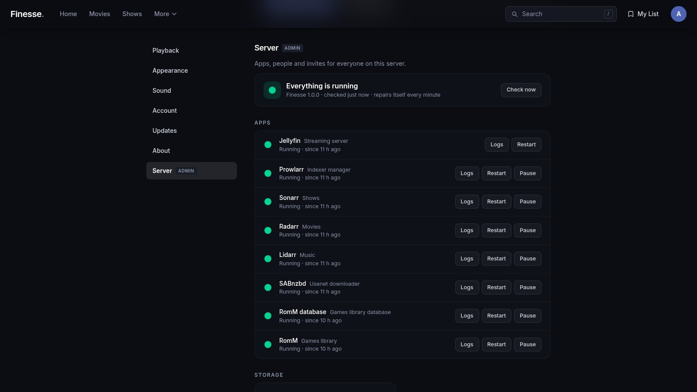
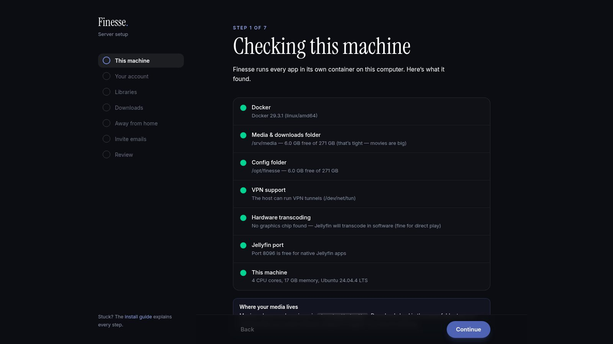
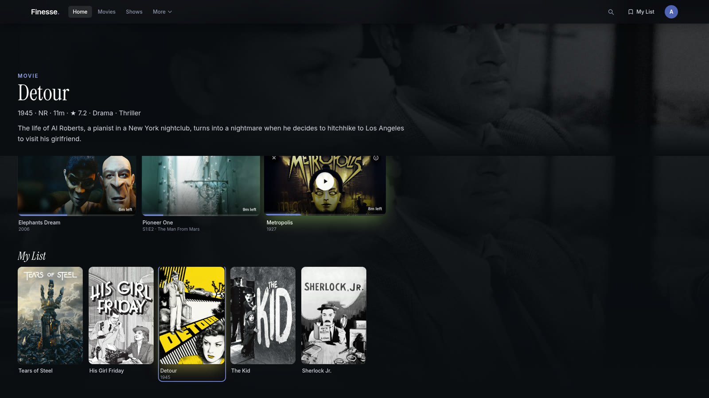
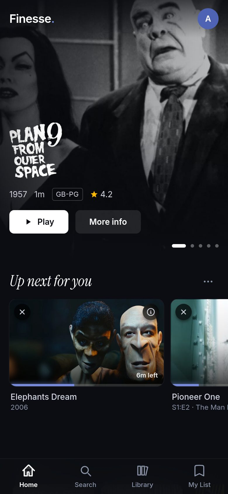

<div align="center">

# Finesse.

**Your own streaming service.** Movies, shows and music on every screen, installed, connected
and looked after for you.

[](docs/media/finesse-tour.mp4)

**[▶ Watch the 9-minute tour](docs/media/finesse-tour.mp4)** · [Install](#install) ·
[Features](#what-you-get) · [For AI agents](docs/agents/INSTALL.md) · [Docs](docs/install.md)

</div>

---

Finesse turns any Linux computer into a Netflix-style service for your household. One command
installs it. A setup page in your browser then installs and connects everything else:
[Jellyfin](https://jellyfin.org) for streaming, Sonarr, Radarr and Lidarr for requests,
Prowlarr for indexers, SABnzbd for Usenet and qBittorrent, which only ever runs behind your
VPN. Once it's built, Finesse keeps the whole thing healthy, backed up and up to date.

Everyone at home uses one app, on the web, their phone and the TV: a home that feels more like
a games console than a catalogue, with the art of whatever you rest on filling the screen.

## The tour

A 9-minute narrated film of the real thing: installing it, the setup page, and every feature on
the web, a phone and a TV, with captions throughout.
[Watch it](docs/media/finesse-tour.mp4), or jump to a chapter in your video player:

`0:00` Welcome · `0:17` Install and set up · `1:49` Building your server ·
`2:07` Profiles and sign-in · `2:15` Home · `2:42` Search · `2:48` A title’s page ·
`3:02` The player · `3:30` Movies and shows · `4:03` Requests and downloads ·
`4:27` Music and lyrics · `4:59` Games · `5:24` Settings, your server and invites ·
`5:56` Groups: friends’ libraries · `6:44` On your phone · `7:32` On your TV ·
`8:23` Get Finesse · `8:36` Credits

The demo library is made of freely licensed and public-domain films and music. See the
[credits](docs/media/CREDITS.md).

## Install

On a 64-bit Linux machine (x86-64 or ARM64) that stays on:

```bash
curl -fsSL https://raw.githubusercontent.com/CoffeeCC/finesse/master/install.sh | bash
```

The installer sets up Docker if it's missing, asks where your media should live, starts Finesse
and prints a setup link. Open that link on any device on your network. The setup page takes
about ten minutes, and nothing is installed until you press **Build my server**.

- **[Install guide](docs/install.md)**: requirements, every setup step, troubleshooting and security.
- **[Already run Jellyfin or the *arr apps?](docs/adopt.md)** Finesse can sit in front of what you
  already have.
- **[TrueNAS SCALE](docs/truenas.md)**: install it from the Apps page, listed with your other apps.
- **[Groups](docs/groups.md)**: share libraries with friends who run Finesse too, and watch and listen to theirs.
- **[Watch on your TV](docs/tv.md)**: the LG webOS app, and other TVs.
- **[Games](docs/games.md)**: turn on the optional retro-games library.
- **[Game streaming](docs/streaming.md)**: Steam on the TV with Wolf and Moonlight. Finesse sets Wolf up, or works with yours.
- **[Let an AI agent install it](docs/agents/INSTALL.md)**: a runbook written for coding agents,
  with a [setup document](setup.schema.json) they can fill in and apply without a browser.

## What you get

### Watching

- **A home that's alive.** Everything that's *now* sits in one row: what you're in the middle
  of, the next episode, what's playing in other rooms, your games, a friend's pick and what just
  arrived. Rest on one and its art (then its preview clip) fills the screen, and the whole app
  takes on its colour. A live line underneath says what's happening in the house.
- **The quick menu.** One button for the whole house: who's playing what and where, how the
  server is doing, downloads, game streaming and friends.
- **Pick up a controller.** Xbox, PlayStation and Switch controllers drive everything, in the
  browser and on the TV: move, select, back, search, the quick menu, tabs and the player.
- **Rows that know you.** **My List**, the household's **Top 10**, *Because you watched*, recently
  added and genre rows. Hide, reorder or add rows with **Customize Home**.
- **Previews everywhere.** Hover a poster, or open a title, and a short clip plays. Finesse
  makes the clips itself in the background: spoiler-light four-cut teasers for episodes.
- **A proper player.** Big, clear controls, a preview as you scrub, chapters and intro/credits
  marks, one menu for audio and subtitles, and a pause screen that shows what's on and what's
  next. The audio and subtitle languages you pick are remembered for the whole series.
- **Search everything.** Press <kbd>/</kbd> anywhere for movies, shows, episodes and people as
  you type.
- **Browse your way.** Genre filters, watched/unwatched chips, any sort order, an A–Z rail, and
  **Surprise me**.
- **Music.** Albums and artists, a real music player, synced lyrics (found online when your
  files don't have them) and a full-screen lyric video.
- **Games.** Optional: retro games (NES to PlayStation) that play right in the browser, with the
  library kept by [RomM](https://romm.app). See [Games](docs/games.md).
- **Game streaming.** One switch sets up [Wolf](https://games-on-whales.github.io/wolf/), which
  runs Steam on your server and streams it to Moonlight on TVs, phones and computers. Finesse
  checks the server first, lists what you can play, and pairs devices with Moonlight's PIN.
  Already run Wolf? Connect it instead. See [Game streaming](docs/streaming.md).
- **Friends' libraries.** Friends who run Finesse too can share their films, shows and music with
  you, and you with them: watch- and listen-only, with nobody getting an account on anyone's
  server. See [Groups](docs/groups.md).

### Getting new things

- **Request anything.** If a search finds nothing in your library, press **Request**. Finesse
  finds it, downloads it, renames it and adds it to the library.
- **The right language.** Downloads come in the title's original language or yours (the one
  you pick in setup), never one nobody at home speaks. The original or dual audio wins a tie.
  Anime is added as anime, so episodes are found by their absolute numbers.
- **Follow along.** See requests waiting for a release and live download progress. Pause
  downloads, cap their speed or pick a different quality from inside the app.
- **Safe by default.** Torrents only ever run inside the VPN's network, with a kill switch.
  Every API key stays on the server.

### Every screen

- **Web**, on any computer.
- **Phones**: a touch-first layout with bottom tabs, a full-screen player and double-tap to skip.
  Add it to your home screen like an app.
- **TVs**: an **LG webOS app** that updates itself, and full D-pad navigation in any TV browser.
  Everything is reachable with the arrows and OK.
- **Play on another device.** Send what you're watching to the TV, then use your phone as the
  remote. **Continue here** picks up what's playing elsewhere.

### Your household

- **Profiles.** Everyone gets their own account, history, My List and settings, synced across
  their devices.
- **Invites.** Create a link or QR code, or email it. People create their own account and see
  only the libraries you choose.
- **Away from home.** Optional Tailscale Funnel or Cloudflare Tunnel, with no router changes.
- **Make it yours.** Accent colour, display size and interface sounds.

### It looks after itself

- **Every minute** it checks each app, the VPN and your disks. It recreates or restarts anything
  that has stopped.
- **Every night** it backs up every app's settings and database.
- **Updates in one click.** Finesse backs up, updates and rolls back by itself if the new
  version doesn't start. Newer tested versions of Jellyfin and the other apps install
  overnight.
- **Settings → Server** shows each app's health, the VPN's public address, storage, backups
  and logs, with Restart and Pause buttons.

## Screenshots

| | |
|---|---|
|  |  |
|  |  |
|  |  |
|  |  |

<p align="center"></p>

## How it's built

Finesse is two things in one Docker image:

- **The app** (`src/`): React 19, TypeScript, Vite and Tailwind. It talks to Jellyfin for media
  and to the Finesse server for everything else. The same code builds the LG TV app, which runs
  on the TV's Chromium 68.
- **The server** (`server/`): Node 22 with no npm dependencies. It serves the app, proxies
  Jellyfin and the *arr APIs (adding their keys itself), runs invites and updates, and
  installs, wires and maintains the stack through the Docker Engine API.

Every app it installs is pinned to a version tested with that Finesse release. Finesse only
touches containers labelled `finesse.managed`, and re-running setup changes nothing that's
already right. See [ROADMAP.md](ROADMAP.md) for the architecture and the reasoning behind it.

## Questions

Why it needs the Docker socket, who can do what, opening it to the internet, the LG Developer Mode
timer and more: see the [FAQ](docs/faq.md).

## Contributing

Bug reports and pull requests are welcome. Please read [CONTRIBUTING.md](CONTRIBUTING.md) and
[AGENTS.md](AGENTS.md) (the working guide for people and AI agents) first. For security issues,
see [SECURITY.md](SECURITY.md).

```bash
npm ci
npm run dev             # the app on http://localhost:5173/finesse/
npm run server:test     # server tests (no Docker needed)
```

## Support Finesse

Finesse is free, and it's made in spare time. If it makes movie night better, you can
[chip in on Ko-fi](https://ko-fi.com/cryptohsaka). There's a **Support Finesse** button in
Settings → About too.

## Please use it responsibly

Finesse organises media you have the right to watch. It doesn't come with any content,
indexers or accounts, and it doesn't find them for you. What you download, and whether it's
legal where you live, is up to you.

Finesse isn't affiliated with Jellyfin, the Servarr projects, SABnzbd, qBittorrent, Gluetun,
Tailscale or Cloudflare. It installs their official images and relies on their great work.

## License

[MIT](LICENSE). The demo media in the tour and screenshots has its own licenses, listed in
[docs/media/CREDITS.md](docs/media/CREDITS.md).
